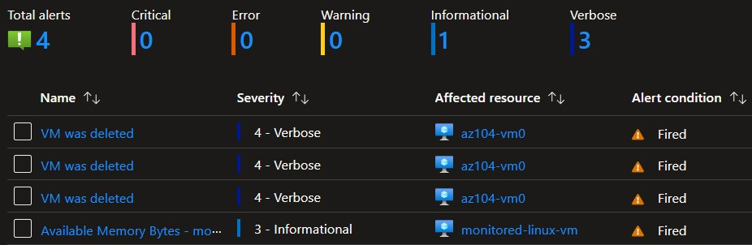

# Implementing Monitoring in Azure using Azure Monitor

## Intro
      In this post I'll walk through my experience with implementing monitoring in Azure using Azure Monitor, including creating alerts, configuring Action Groups, and querying logs to monitor Azure resources.

## Lab Overview
  

### Task 1: Deploy infrastructure using a template
  1. Downloaded the provided json template file.
  2. Used the 'Deploy a custom template' feature to upload and provisiion the resources.
  3. Enabled Azure Monitor for VMs via Monitor > VM Insights > Configure Insights > Enable.

### Task 2: Creating an alert
  1. Added a new alert and set the condition to trigger on the 'Delete Virtual Machine' signal.

### Task 3: Configure Action Group Notifications
  1. Added a new Action Group to the alert, named 'AlertOpsTeam'.
  2. Set the notification to email and to specified my email address.
  3. Created the action group and the alert.

### Task 4: Trigger an alert and confirm it works
  1. Deleted the VM via the Azure portal
  2. Confirmed that I received the notification email
  3. Confirmed that the Azure Monitor Alerts page displayed the alerts

 

## Key Learnings

  * Deploying infrastructure using templates
  * Azure Monitor
  * Creating alerts
  * Configuring Action Groups
  * Configuring alert processing rules
  * Querying Azure Monitor logs

## Conclusion