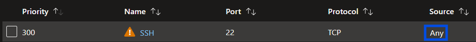
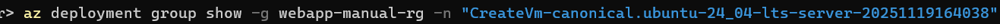
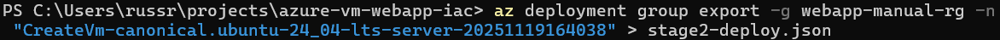
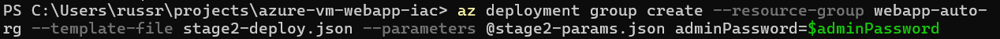

# Create a Container Web Server with an ARM Template

## Project Scenario

As a Cloud Administrator, I'm going to deploy a legacy containerized web app to an Azure VM. Since I don't want to be doing things manually more that once, I'm then going to convert the solution into an Azure Resource Manager (ARM) template.

I'll create a Key Vault to improve security, and add a custom script extension to help with automating the deployment process.

## Project Stages

* Stage 1 - Manually setup a VM and host a docker web app
* Stage 2 - Create an ARM template to speed-up future deployments
* Stage 3 - Setup Key Vault to store credentials for the deployment
* Stage 4 - Add a custom script to automate the web app config
* Stage 5 - Cleanup

## STAGE 1

### Create the VM

I signed into my Azure Portal, then selected Create a Resource, followed by Virtual Machine. I selected the following for my base VM:

* Size: Standard_B1s
* Image: Ubuntu Server 24.04 LTS
* Inboud port rules: Allow SSH (22)

### Configure the Network Security Group

#### Restrict SSH to my IP

I first addressed the issue of SSH on the VM being open to the Internet (source=ANY) by modifying the configuration of the NSG.

To do this, I selected the default resource group created during the VM setup, then selected the NSG, then Settings > Inbound Security Rules. Once there, I selected the name/lin 'SSH' in the SSH rule to access its configuation, and then changed the source from 'ANY' to my IP address.

#### Configure an inbound HTTP allow rule

In order to allow Internet access to the web application, I also needed to add an HTTP allow rule. 

#### SSH into the VM and setup the Web app

In PowerShell, ran 'SSH username@Public_IP' to connect to the VM using SSH.

Once SSH'ed into the VM, I used apt-get to udpate the system and to install docker.io, then cloned and built the web app from a GitHub respository.

Once that was compolete I confirmed that I was able to access the web app via its public IP address.

## STAGE 2

### Create an ARM template

I chose to use the Azure CLI to create the ARM template, so I opened PowerShell and ran the 'az login' command, and signed into my Azure subscription.

First, I viewed the existing deployment

From the results of that command, I located the name of the deployment.

From there I pulled additional information about the deployment using the resource group name.

I created local folder for the template files and changed into that directory.

I then exported the ARM template that the Azure Portal created:

as well as the parameters file that the Azure Portal created:

### Update the NSG in the template

Since the template files I downloaded only included the configuration that I specified when the VM was created, and not the changes I made to the NSG to lock down SSH and HTTP (to only my IP), I needed to locate the NSG parameters in the json file I downloaded.

I used vscode to view and edit the json file.

The NSG parameters were listed as shown below.

I modified the SSH > "sourceAddressPrefix" line with my IP address, and added a "Web" rule for HTTP traffic, also locked down to my IP address.

### Deploy the solution

Next, I moved on to deploying a new VM using the new template files. First, I created a new resource group, "webapp-auto-rg"

For the time being I used the admin password to create the new VM from template, so to improve security (a little bit) is used bash to create a variable to store the admin password and passed that variable to the commmand rather than typing the admin password openly in the terminal.

Then I deployed the solution using the modified template files.

On the Azure Portal, I browsed to the new resource group, "webapp-auto-rg" and confirmed that the new NSG had the SSH and HTTP Inbound rules.

I then went into the properties of the new VM, and copied the public IP. I confirmed that I was able to SSH into the new VM.

and also confirmed that I could not access the webapp on the new VM IP address, which makes sense, as it has not been setup yet.

### Clean Up

Since I no longer require the original VM, or its associated resources, I deleted "webapp-manual-rg" using the Azure Portal. No point in paying for resources for any longer than they are required.

### Progress

Notably, the current solution has a few limitations that I'll be addressing as I move forward in the project, such as:

* I had to manually install Docker
* I had to manually build and deploy the web app
* I had to input the admin credentials for the VM manually

## STAGE 3

