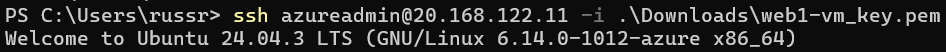

# Create a Container Web Server with an ARM Template

## Project Scenario

As a Cloud Administrator, I'm going to deploy a legacy containerized web app to an Azure VM. Since I don't want to be doing things manually more that once, I'm then going to convert the solution into an Azure Resource Manager (ARM) template.

I'll create a Key Vault to improve security, and add a custom script extension to help with automating the deployment process.

## Project Stages

* Stage 1 - Manually setup a VM and host a docker web app
* Stage 2 - Create an ARM template to speed-up future deployments
* Stage 3 - Setup Key Vault to store credentials for the deployment
* Stage 4 - Add a custom script to automate the web app config
* Stage 5 - Cleanup

## Stage 1

### Create the VM

I signed into my Azure Portal, then selected Create a Resource, followed by Virtual Machine. I selected the following for my base VM:

* Size: Standard_B1s
* Image: Ubuntu Server 24.04 LTS
* Inboud port rules: Allow SSH (22)

### Configure the Network Security Group

#### Restrict SSH to my IP

I first addressed the issue of SSH on the VM being open to the Internet (source=ANY) by modifying the configuration of the NSG.

To do this, I selected the default resource group created during the VM setup, then selected the NSG, then Settings > Inbound Security Rules. Once there, I selected the name/lin 'SSH' in the SSH rule to access its configuation, and then changed the source from 'ANY' to my IP address.

#### Configure an inbound HTTP allow rule

In order to allow Internet access to the web application, I also needed to add an HTTP allow rule. 

#### SSH into the VM and setup the Web app

In PowerShell, ran 'SSH username@Public_IP -i SSH_Key' to connect to the VM using SSH.

Once SSH'ed into the VM, I used apt-get to udpate the system and to install docker.io, then cloned and built the web app from a GitHub respository.

Once that was compolete I confirmed that I was able to access the web app via its public IP address.

